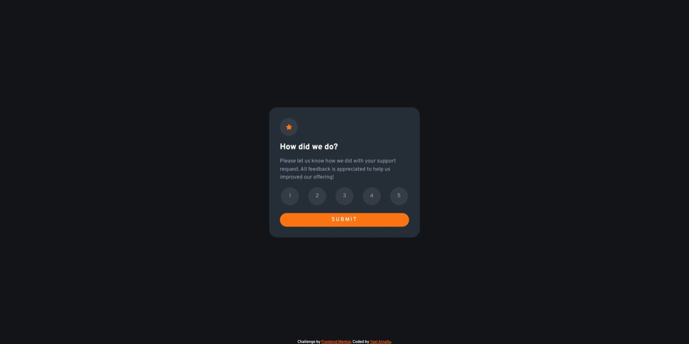

# Frontend Mentor - Interactive rating component solution

This is a solution to the [Interactive rating component challenge on Frontend Mentor](https://www.frontendmentor.io/challenges/interactive-rating-component-koxpeBUmI). Frontend Mentor challenges help you improve your coding skills by building realistic projects. 

## Table of contents

- [Overview](#overview)
  - [The challenge](#the-challenge)
  - [Screenshot](#screenshot)
  - [Links](#links)
- [My process](#my-process)
  - [Built with](#built-with)
  - [What I learned](#what-i-learned)
  - [Continued development](#continued-development)
  - [Useful resources](#useful-resources)
- [Author](#author)
- [Acknowledgments](#acknowledgments)

## Overview

### The challenge

Users should be able to:

- View the optimal layout for the app depending on their device's screen size
- See hover states for all interactive elements on the page
- Select and submit a number rating
- See the "Thank you" card state after submitting a rating

### Screenshot

### Links

- Solution URL: [Add solution URL here](https://your-solution-url.com)
- Live Site URL: [Add live site URL here](https://your-live-site-url.com)

## My process

### Built with

- Semantic HTML5 markup
- CSS custom properties
- SCSS
- Flexbox
- JavaScript

### What I learned

Actually really proud since its my first JavaScript proyect and i really like how it went. I had an issue with the "Get Back" button and i still cant find a solution but aside from that
i think i did really well.

### Continued development

I will love to keep improving at javascript, i really like it.

### Useful resources

- [Youtube Video](https://www.youtube.com/watch?v=SzDGqkifB_g&ab_channel=CodingTube) - This video really help me

## Author

- Frontend Mentor - [@yaeltw](https://www.frontendmentor.io/profile/yaeltw)
- GitHub - [yaeltw](https://github.com/yaeltw)

